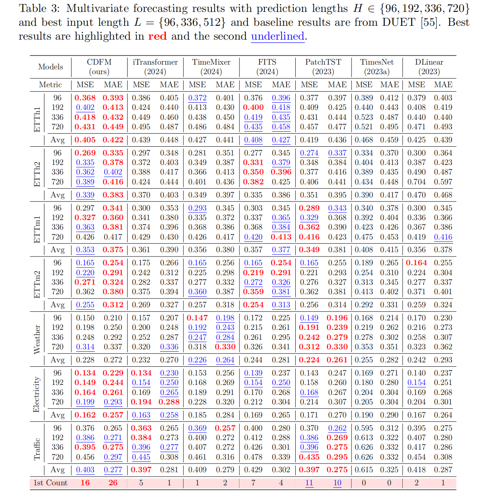

# CDFM

## Introduction
Non-stationarity is an intrinsic property of real-world time series and plays a crucial role in time series forecasting. Previous studies primarily adopt instance normalization to attenuate the non-stationarity of the original series for better predictability. However, instance normalization that directly removes the inherent non-stationarity can lead to three issues: (1) disrupting global temporal dependencies, (2) ignoring channel-specific differences, and (3) producing over-smoothed predictions.
To address these issues, we theoretically demonstrate that variance can be a valid and interpretable proxy for quantifying the non-stationarity of time series.
Based on the analysis, we propose a novel lightweight Channel-wise Dynamic Fusion Model (CDFM), which selectively and dynamically recovers the intrinsic non-stationarity of the original series, while keeping the predictability of the normalized series.


We conduct extensive experiments to evaluate the performance and efficiency of our model on seven widely-used time series datasets.

Multivariate forecasting results:



## Usage

### Data Preparation

All the 7 datasets are available at the [Google Driver](https://drive.google.com/drive/folders/1ZOYpTUa82_jCcxIdTmyr0LXQfvaM9vIy) provided by Autoformer.


### Training Example

We provide scripts for CDFM. You can easily reproduce the results from the paper by running the provided script command.

```
sh scripts/CDFM/etth1.sh
```

## Acknowledgement
We gratefully acknowledge the following GitHub repositories for their valuable codebases and datasets:
- DLinear (https://github.com/cure-lab/LTSF-Linear)
- PatchTST (https://github.com/yuqinie98/patchtst)